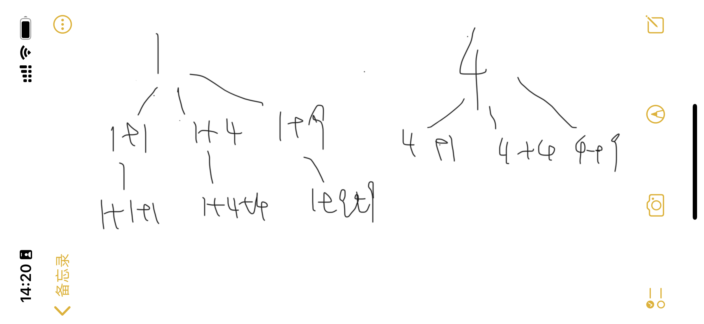

# 广度优先搜索(BFS)
## BFS的基本模板
1. 入队(Queue)，加入已访问集合(Set)
2. 记录层级的长度(size)，层级(step)
3. 根据层级长度出队
4. 进行枚举逻辑，
5. 入队，加入已访问集合(Set)

基本所有的BFS都可以根据这个模板进行编码，  
但是难点就是要找到枚举逻辑。

枚举逻辑最好可以转换为树或者图，  
然后，将该结构画出来，再进行解题就会变得非常容易。  
例如：  
[Letcode的Perfect Square](https://leetcode-cn.com/problems/perfect-squares/solution/shu-ju-jie-gou-he-suan-fa-bfsdong-tai-gu-jl6u/)，一旦找到以下的枚举逻辑，
可以说bfs的实现就会变得非常简单。

