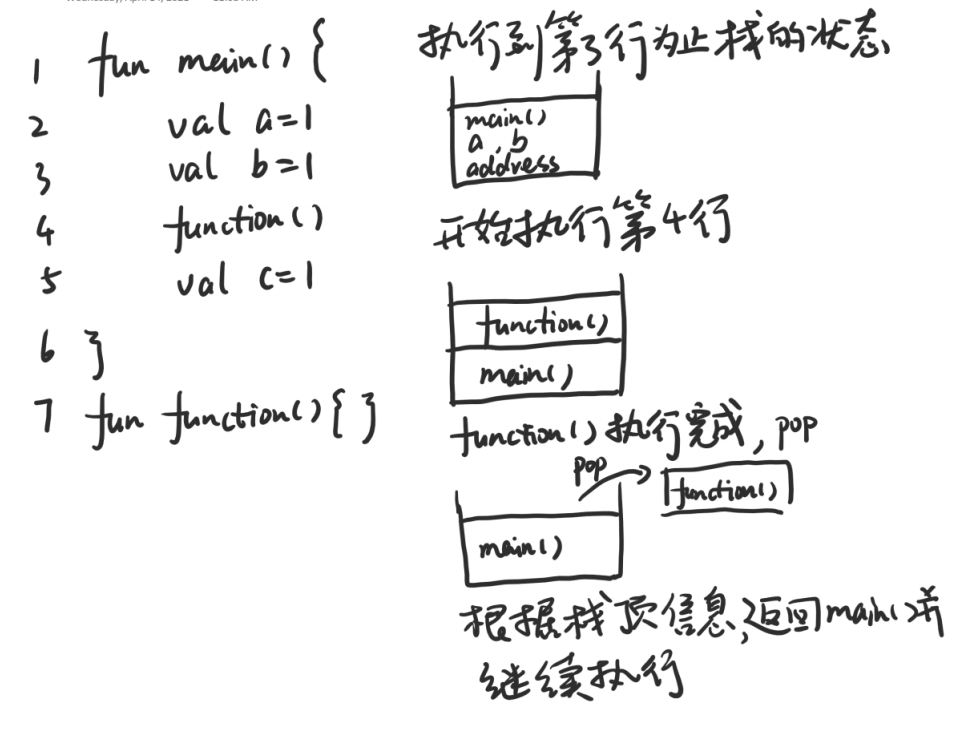

# 数据结构与算法 - 栈
该篇总结栈的应用事例
## 平衡符号
匹配符号。  
开放符号（左括号等）入栈，直到遇到封闭符号（右括号等）出栈，并与封闭封好比较，若匹配则继续，不匹配则抛出异常。

## 方法调用
方法调用相当于左括号，方法返回相当于右括号。  
另外，还需要存储主调函数的变量，以及，返回地址，这些信息称为栈帧(stack frame)。

## memo
完成以下练习：
3.21, 3.22, 3.23, 3.24, ,3.33