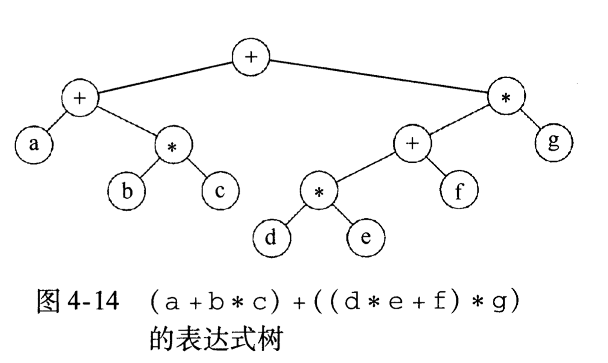

- [树的一些基本概念](#树的一些基本概念)
- [遍历](#遍历)

## 树的一些基本概念
* 根(root)：最顶部的节点
* 叶子节点(leaf)：没有孩子节点的节点
* 兄弟节点(sliblings)：具有相同父节点的节点
* 深度(depth)：根到节点的距离，根的深度为0
* 高度(height)：节点到叶子节点的最长距离
  * 叶子节点的高度为0
  * 树的高度为根的高度
* 二叉查找的平均深度是：O(logN)
* 二叉树查找的时间复杂度为什么是O(logn)：https://www.codenong.com/14426790/
* 二叉树的平均时间复杂度是O(logn),但是，如果按顺序插入节点，形成的二叉树就是一个链表，因此，最坏情况的时间复杂度为O(n)。

## 遍历

* 先序遍历(中左右)：++a*bc*+*defg
* 中序遍历(左中右)：a+b*c+d*e+f*g (可用于排序)
* 后序遍历(左右中)：abc*+de*f+g*+ (计算高度，用于avl树)