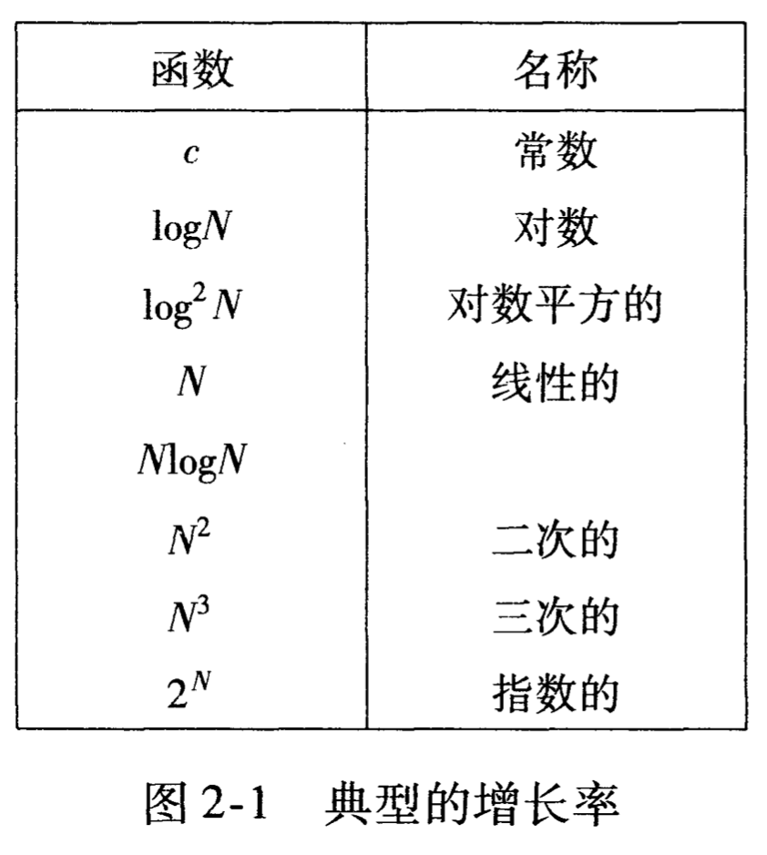
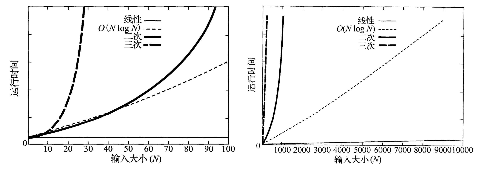

- [数据结构与算法 - 时间复杂度计算](#数据结构与算法---时间复杂度计算)
  - [2. 算法分析](#2-算法分析)
    - [常见函数的增长率：](#常见函数的增长率)
    - [常见函数的增长率图：](#常见函数的增长率图)
    - [运行时间的计算：](#运行时间的计算)
  - [运行时间中的对数](#运行时间中的对数)
    - [折半查找](#折半查找)
    - [欧几里得算法](#欧几里得算法)
    - [递归时间复杂度的推算](#递归时间复杂度的推算)
  - [memo](#memo)
# 数据结构与算法 - 时间复杂度计算
## 2. 算法分析
### 常见函数的增长率：

上图为常见函数增长率由小到大排列后的表。  
可以看到除了常数外，对数的增长率最低。  
这就是为什么在算法设计时，要尽量选择O(logN)的算法。

### 常见函数的增长率图：

由图可以非常清晰的看出各个函数的增长率。注意：对数O(log(n))是小于线性O(N)的。

### 运行时间的计算：
一般法则：  
P21P36: 在O的计算过程中，一般低阶可以忽略，常数也可以弃掉。（由于需要考虑的精度较低，最需要关注的是函数的上界。）  
例如：T(N)=O(2N^2)或T(N)=O(N^2+N)应该写做T(N)=O(N^2)

法则1 - for循环  
内部运行时间乘以迭代。

法则2 - 嵌套for循环
内部运行时间乘以所有for循环迭代的乘积。(是指数的)

法则3 - 循序语句
运行时间求和。但是，只取其中最大的。(因为只关注上界)

法则4 - if/else 语句
ifelse语句的运行时间，加上分支中运行时间长者的总和。基本考虑分支运行时间长者即可。(关注上界)

## 运行时间中的对数
基本只有一些特殊的算法可以达到logn的时间复杂度。  
这里的时间复杂度是不考虑读入数据的，因为，假设有n个数据，只要读入的话，时间复杂度至少是O(n)。

一般，如果一个算法用常数时间将问题的大小削减为一部分(通常是1/2)，那么该算法就是O(N)=logN

### 折半查找
二分查找的时间复杂度计算如下：假设一个数组长度为n,每次查找后数据长度减半，第一次查找后数据长度为n/2,第二次查找后数据长度为n/(2的2次方)，第k次查找后数据长度为n/(2的k次方)，最坏情况下数数据长度为1时找到该数，即n/(2的k次方)=1, 解得k=log2(N).

### 欧几里得算法

### 递归时间复杂度的推算
T(n) = 2T(n/2)+n  
T(1) = 1  

通过代入法：  
T(n/2) = 2T(n/2^2)+n/2^1  
T(n/2^2) = 2T(n/2^3)+n/2^2  
...  

带入T(n/2)到T(n)  
T(n) = 2(2T(n/2^2)+n/2^1)+n = 2^2T(n/2^2)+2n  

带入T(n/2^2)到上一项的T(n)  
T(n) = 2^3T(n/2^3)+3n 

...到k项，可以看出规律  
T(n) = 2^kT(n/2^k)+kn  

当n=2^k时,等价于k=log(n)  
T(n) = 2^kT(1)+k*n  
T(n) = 2^k+k*n  

通过对数法则：  
T(n) = n+nlog(n)  
根据O(n)法则求上界：  
O(n) = nlog(n)  
Ref：https://blog.csdn.net/woshilsh/article/details/89429130

## memo

1，2章：时间复杂度？  
3章：链表，栈，队列。  
4章：树。查找树  
7章：排序。  